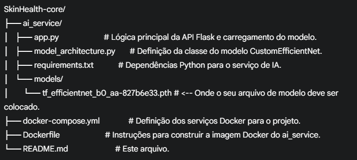

# SkinHealth-core: Serviço de Classificação de Lesões de Pele por IA

Este repositório contém o serviço de backend principal do projeto SkinHealth, responsável por realizar a classificação de lesões de pele (benignas/malignas) utilizando um modelo de Inteligência Artificial. O serviço é implementado em Python com Flask e PyTorch, e é conteinerizado usando Docker e Docker Compose para fácil implantação e escalabilidade.

## Sumário

- [Visão Geral](#visão-geral)
- [Funcionalidades](#funcionalidades)
- [Estrutura do Projeto](#estrutura-do-projeto)
- [Pré-requisitos](#pré-requisitos)
- [Configuração do Ambiente](#configuração-do-ambiente)
  - [1. Clonar o Repositório](#1-clonar-o-repositório)
  - [2. Adicionar o Modelo de IA](#2-adicionar-o-modelo-de-ia)
  - [3. Construir e Iniciar os Contêineres Docker](#3-construir-e-iniciar-os-contêineres-docker)
- [Uso da API](#uso-da-api)
  - [Endpoint: `/predict`](#endpoint-predict)
- [Depuração e Solução de Problemas](#depuração-e-solução-de-problemas)
  - [Verificando Logs](#verificando-logs)
  - [Reconstrução Forçada](#reconstrução-forçada)
- [Tecnologias Utilizadas](#tecnologias-utilizadas)
- [Contribuição](#contribuição)
- [Licença](#licença)

---

## Visão Geral

O `SkinHealth-core` é um microserviço que expõe um endpoint RESTful para classificar imagens de lesões de pele. Ele utiliza um modelo EfficientNet pré-treinado (fine-tuned) para realizar a inferência, recebendo a URL de uma imagem como entrada.

## Funcionalidades

- Classificação de imagens de lesões de pele em "benignas" ou "malignas".
- API RESTful simples para integração com outras aplicações.
- Uso de modelos de Deep Learning (EfficientNet) com PyTorch e `timm`.
- Conteinerização com Docker para ambiente de execução consistente.

## Estrutura do Projeto



## Pré-requisitos

Antes de começar, certifique-se de ter os seguintes softwares instalados em sua máquina:

-   **Docker Desktop:** Inclui Docker Engine e Docker Compose.
    -   [Download Docker Desktop](https://www.docker.com/products/docker-desktop/)

## Configuração do Ambiente

Siga os passos abaixo para configurar e executar o projeto em seu ambiente local.

### 1. Clonar o Repositório

Primeiro, clone este repositório para sua máquina local:

```bash
git clone <URL_DO_SEU_REPOSITORIO>
cd SkinHealth-core

2. Adicionar o Modelo de IA
O serviço de IA requer um modelo pré-treinado para funcionar. Você deve colocar o seu arquivo de modelo (.pth) no diretório ai_service/models/.

Certifique-se de que o nome do arquivo corresponde ao configurado em ai_service/app.py (atualmente tf_efficientnet_b0_aa-827b6e33.pth).

# Exemplo: Copie seu modelo para o diretório correto
cp /caminho/para/seu/modelo/tf_efficientnet_b0_aa-827b6e33.pth ai_service/models/

3. Construir e Iniciar os Contêineres Docker
Navegue até o diretório raiz do projeto (onde está o docker-compose.yml) e execute os comandos para construir as imagens Docker e iniciar os serviços:

docker-compose down --volumes # Opcional: Garante que contêineres e volumes antigos sejam removidos
docker-compose build          # Constrói as imagens Docker. Isso pode levar alguns minutos.
docker-compose up -d          # Inicia os serviços em segundo plano.

Após a execução bem-sucedida, o serviço de IA (ai_service) estará em execução na porta 5000 do seu localhost.

Uso da API
O serviço de IA expõe um endpoint principal para realizar a classificação de imagens.

Endpoint: /predict
Método: POST

URL: http://localhost:5000/predict

Headers:

Content-Type: application/json
Corpo da Requisição (JSON):

{
    "image_url": "[https://url.da/sua/imagem.jpg](https://url.da/sua/imagem.jpg)"
}

Substitua https://url.da/sua/imagem.jpg pela URL real da imagem que você deseja classificar.

Exemplo de Chamada (usando curl em um terminal Unix-like como Git Bash, WSL ou Linux):

curl -X POST \
     -H "Content-Type: application/json" \
     -d '{"image_url": "[https://oncologiabrasil.com.br/wp-content/uploads/2024/12/Noticia_Site_x-2-1200x535.png](https://oncologiabrasil.com.br/wp-content/uploads/2024/12/Noticia_Site_x-2-1200x535.png)"}' \
     http://localhost:5000/predict

Se estiver no Prompt de Comando do Windows (cmd.exe), use o comando em uma única linha:

curl -X POST -H "Content-Type: application/json" -d "{\"image_url\": \"[https://oncologiabrasil.com.br/wp-content/uploads/2024/12/Noticia_Site_x-2-1200x535.png](https://oncologiabrasil.com.br/wp-content/uploads/2024/12/Noticia_Site_x-2-1200x535.png)\"}" http://localhost:5000/predict

(Note as aspas duplas no JSON e o escape das aspas internas \" para cmd.exe)

Exemplo de Resposta (JSON):

{
    "confidence": 0.6748,
    "model_version": "efficientnet_classifier_v1.0",
    "result": "malignant",
    "status": "success"
}

Depuração e Solução de Problemas
Verificando Logs
Para ver a saída dos logs do serviço de IA e depurar possíveis problemas:

docker-compose logs ai_service

Para seguir os logs em tempo real:

docker-compose logs -f ai_service

Reconstrução Forçada
Se você fizer alterações no código-fonte (Python) ou nas dependências (requirements.txt), precisará reconstruir a imagem Docker para que as mudanças tenham efeito:

docker-compose down --volumes
docker-compose up --build -d

Tecnologias Utilizadas
Python
Flask: Framework web para a API.
PyTorch: Biblioteca de Deep Learning.
timm: Biblioteca para modelos de visão computacional.
Docker: Conteinerização da aplicação.
Docker Compose: Orquestração de múltiplos contêineres.